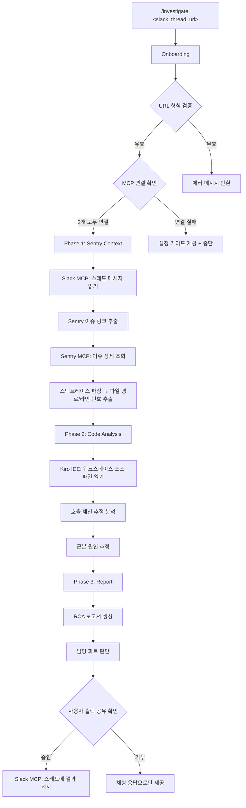
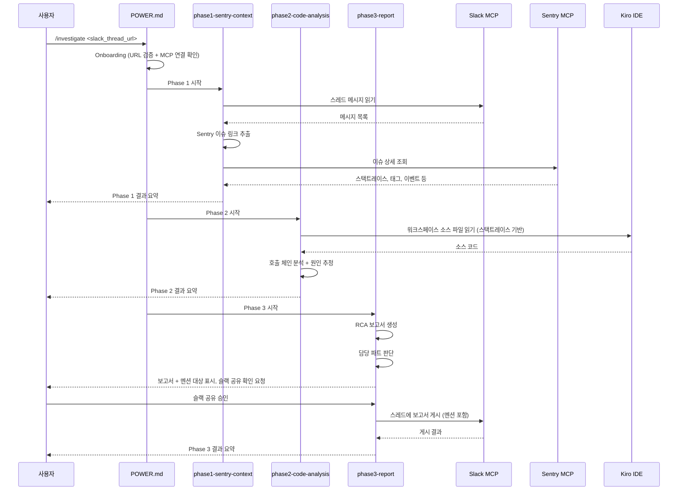

# 설계 문서: Investigate Power

## 개요

Investigate Power는 Kiro Power 형태로 구현되는 Sentry 에러 자동 분석 도구이다. 슬랙 스레드에서 Sentry 이슈 링크를 추출하고, Sentry MCP를 통해 에러 상세 정보를 조회하며, Kiro IDE의 기본 코드 탐색 기능으로 워크스페이스의 코드를 분석하여 근본 원인 분석(RCA) 보고서를 생성한다. 최종 결과는 원본 슬랙 스레드에 담당 파트 멘션과 함께 게시된다.

이 Power는 프론트엔드(Next.js) 프로젝트에 특화되어 있으며, Kiro IDE 워크스페이스에 열려 있는 코드베이스를 직접 탐색하여 분석한다.

### 핵심 설계 결정

1. **Kiro Power 형태**: POWER.md 매니페스트 파일과 3개의 Steering 파일로 구성
2. **MCP 기반 외부 연동**: Slack, Sentry 2개 MCP 서버를 통해 외부 데이터를 조회
3. **3단계 파이프라인**: Sentry 컨텍스트 수집 → 코드 분석 → 보고서 생성의 순차적 실행
4. **IDE 기본 코드 탐색**: Kiro IDE의 기본 파일 탐색 기능으로 워크스페이스 코드를 직접 읽음 (별도 MCP 불필요)

## 아키텍처

### 전체 구조



### Steering 파일 실행 흐름



## 컴포넌트 및 인터페이스

### 1. POWER.md (매니페스트)

Power의 진입점이자 설정 파일. 다음을 정의한다:
- Power 이름, 설명, 실행 명령어 (`/investigate`)
- 필수 MCP 서버 목록 (Slack, Sentry)
- Onboarding 단계 (URL 검증, MCP 연결 확인)
- Steering 파일 실행 순서

### 2. phase1-sentry-context.md (Steering 파일 1)

Sentry 에러 컨텍스트를 수집하는 단계:
- Slack MCP를 통해 스레드 메시지 읽기
- 메시지에서 Sentry 이슈 링크 추출 (정규식: `https://[^/]+\.sentry\.io/issues/\d+`)
- 여러 링크가 있으면 모두 추출
- Sentry MCP를 통해 각 이슈의 상세 정보 조회
- 스택트레이스에서 소스 파일 경로와 라인 번호 추출

### 3. phase2-code-analysis.md (Steering 파일 2)

Kiro IDE 워크스페이스를 통한 코드 분석 단계:
- 스택트레이스 기반 소스 파일 읽기 (IDE 기본 파일 탐색)
- 실패 지점의 호출 체인 추적 (상위/하위 메서드)
- Next.js 특화 분석 (에러 핸들링, 비동기 처리, API 호출 체인)
- 최소 3개 이상 관련 파일 분석 후 원인 추정 시작

### 4. phase3-report.md (Steering 파일 3)

RCA 보고서 생성 및 슬랙 게시 단계:
- RCA 보고서 생성 (이슈 요약, 에러 상세, 근본 원인, 코드 경로, 조치 방안, 재발 방지)
- 추정 부분 `[추정]` 태그 표기
- 담당 파트 판단 및 멘션 대상 결정
- 사용자에게 보고서와 멘션 대상을 표시하고 슬랙 공유 여부 확인
- 사용자 승인 후 Slack MCP를 통해 원본 스레드에 게시

### 인터페이스 정의

#### Slack MCP 인터페이스

| 동작 | 입력 | 출력 |
|------|------|------|
| 스레드 메시지 읽기 | channel_id, thread_ts | 메시지 목록 (텍스트, 작성자, 타임스탬프) |
| 스레드에 메시지 게시 | channel_id, thread_ts, text | 게시 결과 (성공/실패) |

#### Sentry MCP 인터페이스

| 동작 | 입력 | 출력 |
|------|------|------|
| 이슈 상세 조회 | issue_id 또는 issue_url | 스택트레이스, 이벤트 상세, 태그, 발생 횟수, 최초/최근 발생 시간, 영향 사용자 수 |

#### Kiro IDE 코드 탐색

| 동작 | 입력 | 출력 |
|------|------|------|
| 소스 파일 읽기 | 파일 경로 (워크스페이스 상대 경로) | 파일 내용 |
| 파일 검색 | 파일명 또는 경로 패턴 | 매칭된 파일 목록 |


## 데이터 모델

### Slack Thread URL 파싱 결과

```typescript
interface SlackThreadInfo {
  workspace: string;      // 슬랙 워크스페이스 이름
  channelId: string;      // 채널 ID (예: C01ABCDEF)
  threadTs: string;       // 스레드 타임스탬프 (예: 1234567890.123456)
}
```

### Sentry 이슈 링크

```typescript
interface SentryIssueRef {
  issueUrl: string;       // 원본 Sentry 이슈 URL
  issueId: string;        // 이슈 ID (URL에서 추출)
  organization: string;   // Sentry 조직명
  project: string;        // Sentry 프로젝트명 (선택, URL에 포함된 경우)
}
```

### Sentry 이슈 상세 정보

```typescript
interface SentryIssueDetail {
  issueId: string;
  title: string;                // 에러 타입 및 메시지
  culprit: string;              // 발생 위치 요약
  firstSeen: string;            // 최초 발생 시간 (ISO 8601)
  lastSeen: string;             // 최근 발생 시간 (ISO 8601)
  count: number;                // 총 이벤트 수
  userCount: number;            // 영향받는 사용자 수
  tags: Record<string, string>; // 태그 정보
  stacktrace: StackFrame[];     // 스택트레이스 프레임 목록
  latestEvent: EventDetail;     // 최근 이벤트 상세
}

interface StackFrame {
  filename: string;     // 소스 파일 경로
  lineNo: number;       // 라인 번호
  colNo: number;        // 컬럼 번호
  function: string;     // 함수명
  context: string[];    // 주변 코드 라인 (Sentry가 제공하는 경우)
  inApp: boolean;       // 앱 코드 여부 (node_modules 등 제외)
}

interface EventDetail {
  eventId: string;
  timestamp: string;
  contexts: Record<string, any>;  // 브라우저, OS 등 컨텍스트
  request?: RequestInfo;          // HTTP 요청 정보 (있는 경우)
}
```

### 코드 분석 결과

```typescript
interface CodeAnalysisResult {
  analyzedFiles: AnalyzedFile[];
  callChain: CallChainNode[];
}

interface AnalyzedFile {
  path: string;           // 워크스페이스 내 파일 경로
  lineRange: [number, number]; // 분석한 라인 범위
  findings: string;       // 분석 소견
  notFound: boolean;      // 파일을 찾지 못한 경우 true
}

interface CallChainNode {
  file: string;
  function: string;
  lineNo: number;
  calledBy?: CallChainNode;  // 상위 호출자
  calls?: CallChainNode[];   // 하위 호출 대상
}
```

### RCA 보고서

```typescript
interface RCAReport {
  issueSummary: {
    errorType: string;
    location: string;
    eventCount: number;
    userCount: number;
    sentryLink: string;
  };
  errorDetail: {
    stacktrace: string;       // 포맷팅된 스택트레이스
    latestEvent: string;      // 최근 이벤트 요약
    tags: Record<string, string>;
  };
  rootCauseAnalysis: {
    description: string;      // 근본 원인 설명
    relatedFiles: Array<{
      path: string;
      lineNo: number;
      explanation: string;
    }>;
    isEstimation: boolean;    // [추정] 태그 여부
  };
  immediateActions: Array<{
    description: string;      // 조치 설명
    codeChange?: string;      // 구체적 코드 수정 제안
    configChange?: string;    // 설정 변경 제안
  }>;
  preventionSuggestions: string[];  // 재발 방지 제안
  skippedSteps: Array<{
    step: string;
    reason: string;
  }>;
}
```

### 담당 파트 판단 로직

```typescript
type FEPart = '@creator_fe' | '@consumer_fe' | '@core_fe';

interface PartMappingRule {
  pathPatterns: string[];     // 코드 경로 패턴 (glob 또는 prefix)
  projectPatterns: string[];  // Sentry 프로젝트명 패턴
  part: FEPart;
}

// 판단 우선순위:
// 1. 코드 경로 기반 매칭 (스택트레이스의 파일 경로)
// 2. Sentry 프로젝트 정보 기반 매칭
// 3. 기본값: @core_fe
```

