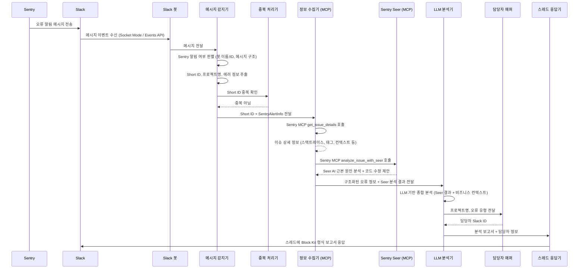
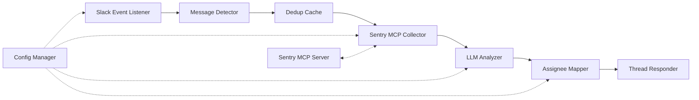
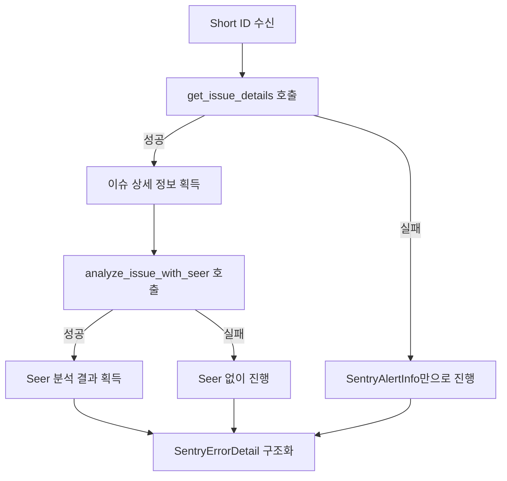

# 기술 설계 문서: Sentry-Slack 자동 분석 시스템

## 개요

Sentry에서 Slack으로 전달되는 오류 알림을 자동으로 감지하고, Sentry MCP(Model Context Protocol) 서버의 도구를 통해 상세 정보를 수집한 뒤, Sentry Seer AI 분석과 LLM을 결합하여 체계적인 원인 분석 보고서를 생성하고 Slack 스레드에 자동 응답하는 시스템이다.

### 핵심 흐름



### 기술 스택 결정

| 항목 | 선택 | 근거 |
|------|------|------|
| 런타임 | Node.js (TypeScript) | Slack Bolt SDK의 공식 지원, 비동기 I/O에 적합 |
| Slack 연동 | @slack/bolt | 공식 SDK, Socket Mode 지원, 이벤트 핸들링 내장 |
| Sentry 정보 수집 | Sentry MCP 도구 | REST API 직접 호출 대신 MCP 프로토콜을 통한 도구 호출. `get_issue_details`, `analyze_issue_with_seer` 등 고수준 도구 활용 |
| LLM | OpenAI API (openai SDK) | 구조화된 프롬프트 기반 분석에 적합 |
| MCP 클라이언트 | @modelcontextprotocol/sdk | MCP 서버와의 통신을 위한 공식 SDK |
| 설정 관리 | YAML (yaml 패키지) + 환경 변수 | 가독성, 핫 리로드 용이 |
| 캐시 | 인메모리 Map + TTL | 단일 인스턴스 운영 기준, 외부 의존성 최소화 |
| 테스트 | Vitest + fast-check | 빠른 실행, PBT 지원 |

### investigate 스킬 참고 사항

본 시스템의 분석 보고서 구조는 investigate 스킬의 접근 방식을 참고한다:
- 증상, 영향 범위, 관련 데이터, 발생 시점 등을 체계적으로 정리
- 근본 원인과 보조 원인을 구분
- 위험도 평가 (🔴 높음 / ⚠️ 중간 / 🟢 낮음)

## 아키텍처

시스템은 파이프라인 패턴으로 구성된다. 각 단계는 독립적인 모듈로 분리되어 테스트와 교체가 용이하다.



### 모듈 구조

```
src/
├── index.ts                 # 앱 진입점, Bolt 앱 초기화
├── config/
│   └── configManager.ts     # 설정 파일 로드 및 핫 리로드
├── detector/
│   └── messageDetector.ts   # Sentry 알림 판별 로직
├── dedup/
│   └── dedupCache.ts        # 중복 이슈 필터링 (TTL 캐시)
├── collector/
│   └── sentryMcpCollector.ts # Sentry MCP 도구 호출 및 정보 구조화
├── analyzer/
│   └── llmAnalyzer.ts       # LLM 프롬프트 구성 및 분석 실행 (Seer 결과 통합)
├── mapper/
│   └── assigneeMapper.ts    # 담당자 매핑 조회
├── responder/
│   └── threadResponder.ts   # Slack Block Kit 응답 생성 및 전송
└── types/
    └── index.ts             # 공유 타입 정의
```

## 컴포넌트 및 인터페이스

### 1. MessageDetector

Slack 메시지가 Sentry 알림인지 판별하고, 이슈 정보를 추출한다.

#### 실제 Sentry Slack 알림 메시지 구조

Sentry 앱이 Slack으로 전송하는 알림 메시지는 다음과 같은 구조를 가진다:

```
발신자: "Sentry" (Slack 봇 앱)
─────────────────────────────────────
🔴 ApiError: /editor/v1/open-channel/post/{id}/publish
/mobile/channel/:channelName/open-editor/:postId

┌─────────────────────────────────────┐
│ Request failed with status code 500 │
└─────────────────────────────────────┘

Events: 39  Users Affected: 2  State: Ongoing  First Seen: 2026-02-19

[Resolve] [Archive] [Select Assignee...]

⚠️ [fatal 에러 급증] ⚠️  @front  @back

Project: javascript-nextjs  Alert: Send a notification for fatal error spikes
Short ID: JAVASCRIPT-NEXTJS-3A11  View Replays

💬 4개의 댓글  5일 전 마지막 댓글
```

#### 인터페이스

```typescript
interface SentryAlertInfo {
  errorTitle: string;          // 예: "ApiError: /editor/v1/open-channel/post/{id}/publish"
  routePath: string | null;    // 예: "/mobile/channel/:channelName/open-editor/:postId"
  errorMessage: string;        // 예: "Request failed with status code 500"
  eventCount: number;          // 예: 39
  usersAffected: number;       // 예: 2
  state: string;               // 예: "Ongoing"
  firstSeen: string;           // 예: "2026-02-19"
  projectSlug: string;         // 예: "javascript-nextjs"
  shortId: string;             // 예: "JAVASCRIPT-NEXTJS-3A11"
  alertRule: string | null;    // 예: "Send a notification for fatal error spikes"
}

interface DetectionResult {
  isSentryAlert: boolean;
  alertInfo: SentryAlertInfo | null;
  issueUrl: string | null;
  threadTs: string;
  channelId: string;
}

interface MessageDetector {
  detect(message: SlackMessage): DetectionResult;
}
```

#### 판별 기준 (우선순위 순)

1. **봇 이름 확인**: 메시지의 `bot_id` 또는 `username`이 설정된 Sentry 봇 ID와 일치
2. **메시지 구조 확인**: Sentry 알림 특유의 구조적 패턴 존재 여부
   - attachments 또는 blocks에 "Short ID" 필드 포함
   - "Events:", "Users Affected:", "State:" 메타 정보 패턴
   - "Project:" 필드 존재
3. **URL 패턴 확인**: 메시지 본문 또는 attachments에 Sentry 이슈 URL 패턴 포함 (`https://<org>.sentry.io/issues/<id>`)

#### Short ID 추출

Sentry 알림 메시지의 하단에 포함된 `Short ID` (예: `JAVASCRIPT-NEXTJS-3A11`)를 추출한다. 이 Short ID는 Sentry MCP 도구를 통해 이슈 상세 정보를 조회하는 데 사용된다.

추출 정규식: `/Short ID:\s*([A-Z0-9]+-[A-Z0-9-]+)/`

### 2. DedupCache

TTL 기반 인메모리 캐시로 중복 이슈 처리를 방지한다.

```typescript
interface DedupCache {
  has(issueId: string): boolean;
  add(issueId: string): void;
  clear(): void;
}
```

- TTL은 설정 파일에서 관리 (기본값: 30분)
- `Map<string, number>` 기반, 주기적 만료 항목 정리

### 3. SentryMcpCollector

Sentry MCP 서버의 도구를 호출하여 오류 상세 정보를 수집하고 구조화한다. 기존 REST API 직접 호출 대신 MCP 프로토콜을 통해 고수준 도구를 활용한다.

#### 사용하는 Sentry MCP 도구

| 도구 | 용도 | 입력 |
|------|------|------|
| `get_issue_details` | 이슈 상세 정보 조회 (스택트레이스, 태그, 컨텍스트 등) | 이슈 Short ID 또는 URL |
| `analyze_issue_with_seer` | AI 기반 근본 원인 분석 및 코드 수정 제안 | 이슈 ID |

#### 인터페이스

```typescript
// Seer AI 분석 결과
interface SeerAnalysisResult {
  rootCause: string | null;        // Seer가 추정한 근본 원인
  codeFixSuggestions: string[];    // 코드 수정 제안
  confidence: number | null;       // 분석 신뢰도 (0~1)
  relatedFiles: string[];          // 관련 파일 경로
}

interface SentryErrorDetail {
  issueId: string;             // Sentry 내부 이슈 ID
  shortId: string;             // 예: "JAVASCRIPT-NEXTJS-3A11"
  title: string;
  errorMessage: string;
  stacktrace: string;
  projectSlug: string;
  level: string;
  environment: string;
  tags: Record<string, string>;
  breadcrumbs: Breadcrumb[];
  issueUrl: string;
  // Seer AI 분석 결과
  seerAnalysis: SeerAnalysisResult | null;
  // Slack 메시지에서 추출한 보조 정보
  slackAlertInfo: SentryAlertInfo;
}

interface SentryMcpCollector {
  collect(shortId: string, alertInfo: SentryAlertInfo): Promise<SentryErrorDetail>;
}
```

#### MCP 도구 호출 흐름



1. **get_issue_details 호출**: Short ID를 전달하여 이슈 상세 정보 조회
   - 스택트레이스, 태그, 브레드크럼, 컨텍스트 등 상세 정보 획득
   - MCP 도구가 내부적으로 Sentry API 인증 및 호출을 처리
2. **analyze_issue_with_seer 호출**: 이슈 ID를 전달하여 Seer AI 분석 실행
   - 근본 원인 분석, 코드 수정 제안, 관련 파일 경로 등 획득
   - Seer 분석은 선택적 — 실패해도 기본 분석은 진행

#### MCP 클라이언트 구성

```typescript
import { Client } from '@modelcontextprotocol/sdk/client/index.js';
import { StdioClientTransport } from '@modelcontextprotocol/sdk/client/stdio.js';

// MCP 클라이언트 초기화
const transport = new StdioClientTransport({
  command: 'npx',
  args: ['-y', '@sentry/mcp-server'],
  env: {
    SENTRY_AUTH_TOKEN: process.env.SENTRY_AUTH_TOKEN,
  },
});

const mcpClient = new Client({ name: 'sentry-slack-bot', version: '1.0.0' });
await mcpClient.connect(transport);

// 도구 호출 예시
const issueDetails = await mcpClient.callTool({
  name: 'get_issue_details',
  arguments: { issue_id_or_url: shortId },
});

const seerAnalysis = await mcpClient.callTool({
  name: 'analyze_issue_with_seer',
  arguments: { issue_id: issueId },
});
```

#### Fallback 전략

- `get_issue_details` 실패 시: Slack 메시지 본문에서 추출한 `SentryAlertInfo`만으로 분석 진행
- `analyze_issue_with_seer` 실패 시: Seer 분석 없이 LLM 분석만으로 진행 (`seerAnalysis: null`)
- 모든 MCP 호출 실패 시: `SentryAlertInfo`의 정보(에러 제목, 에러 메시지, 프로젝트명, 이벤트 수, 영향 사용자 수)를 기반으로 LLM 분석 진행

### 4. LLMAnalyzer

수집된 오류 정보와 Seer AI 분석 결과를 결합하여 종합적인 분석 보고서를 생성한다. investigate 스킬의 분석 구조를 참고하여 체계적인 보고서를 작성한다.

#### 분석 전략: Seer + LLM 결합

- **Seer AI**: 코드 수준의 근본 원인 분석, 구체적인 코드 수정 제안 (기술적 분석)
- **LLM**: 비즈니스 컨텍스트 분석, 영향 범위 평가, 위험도 판단, 즉시 대응 조치 (종합 분석)
- 두 분석을 결합하여 기술적 깊이와 비즈니스 관점을 모두 갖춘 보고서 생성

#### 인터페이스

```typescript
// investigate 스킬 참고: 위험도 평가 포함
type RiskLevel = 'high' | 'medium' | 'low';  // 🔴 높음 / ⚠️ 중간 / 🟢 낮음

interface AnalysisResult {
  // 증상 정리 (investigate 스킬 참고)
  summary: string;               // 오류 요약 (증상)
  symptoms: string[];            // 관찰된 증상 목록
  
  // 원인 분석 (근본 원인 + 보조 원인 구분)
  rootCause: string;             // 근본 원인 (Seer 분석 + LLM 종합)
  contributingFactors: string[]; // 보조 원인/기여 요인
  
  // 영향 평가
  impactScope: string;           // 영향 범위 (이벤트 수, 영향 사용자 수 포함)
  riskLevel: RiskLevel;          // 위험도 평가
  
  // 기술 분석
  relatedCode: string;           // 관련 코드 영역 추정 (Seer 관련 파일 + 경로 정보)
  possibleScenarios: string;     // 발생 가능 시나리오
  
  // 대응 방안
  solutions: string[];           // 해결 대안 (Seer 코드 수정 제안 포함, 최소 1개)
  immediateActions: string[];    // 즉시 대응 조치
  
  // Seer 분석 원본 (참고용)
  seerInsights: SeerAnalysisResult | null;
}

interface LLMAnalyzer {
  analyze(errorDetail: SentryErrorDetail): Promise<AnalysisResult>;
  analyzeFromSlackInfo(alertInfo: SentryAlertInfo): Promise<AnalysisResult>;
}
```

#### LLM 프롬프트 구성

Seer 분석 결과가 있는 경우, LLM 프롬프트에 다음 정보를 모두 포함한다:

1. **오류 기본 정보**: 에러 메시지, 스택트레이스, 브레드크럼
2. **Seer AI 분석 결과**: 근본 원인, 코드 수정 제안, 관련 파일
3. **컨텍스트 정보**: 이벤트 수, 영향 사용자 수, 환경, 태그
4. **분석 지시**: investigate 스킬 스타일의 체계적 분석 요청 (증상 정리, 근본/보조 원인 구분, 위험도 평가)

- 타임아웃: 30초
- 실패 시 기본 응답(오류 정보 요약만 포함) 생성

### 5. AssigneeMapper

프로젝트명과 오류 유형을 기반으로 담당자를 조회한다.

```typescript
interface AssigneeMapping {
  projectName: string;
  errorType?: string;        // 선택적, 특정 오류 유형 매핑
  slackUserId: string;
}

interface AssigneeMapper {
  findAssignee(projectName: string, errorType: string): string; // Slack user ID
}
```

- 매핑 우선순위: 프로젝트+오류유형 > 프로젝트 > 기본 담당자
- 설정 파일에서 매핑 정보 로드

### 6. ThreadResponder

분석 결과를 Slack Block Kit 형식으로 변환하여 스레드에 게시한다. investigate 스킬의 보고서 구조를 참고하여 가독성 높은 응답을 생성한다.

#### 응답 형식 (investigate 스킬 참고)

```
🔍 Sentry 오류 자동 분석 보고서

📋 증상 요약
[오류 요약 및 관찰된 증상]

🔴/⚠️/🟢 위험도: [높음/중간/낮음]
영향 범위: [이벤트 수]건 발생, [사용자 수]명 영향

🎯 근본 원인
[Seer AI + LLM 종합 분석 결과]

📌 보조 원인/기여 요인
- [기여 요인 1]
- [기여 요인 2]

💡 해결 대안
1. [Seer 코드 수정 제안 포함]
2. [추가 해결 방안]

⚡ 즉시 대응 조치
- [즉시 조치 1]
- [즉시 조치 2]

👤 담당자: @[담당자]
🔗 Sentry 이슈: [링크]
```

```typescript
interface ThreadResponse {
  channelId: string;
  threadTs: string;
  blocks: SlackBlock[];
}

interface ThreadResponder {
  buildResponse(analysis: AnalysisResult, assigneeId: string, issueUrl: string): ThreadResponse;
  send(response: ThreadResponse): Promise<void>;
}
```

- 재시도: 최대 3회, 지수 백오프
- 3회 실패 시 관리자 알림 전송

### 7. ConfigManager

YAML 설정 파일을 로드하고 핫 리로드를 지원한다.

```typescript
interface AppConfig {
  slack: {
    botToken: string;        // 환경 변수에서 로드
    appToken: string;        // 환경 변수에서 로드
    channelIds: string[];
    sentryBotUserId: string;
    sentryBotName: string;   // Sentry 앱 봇 표시 이름 (예: "Sentry")
  };
  sentryMcp: {
    command: string;         // MCP 서버 실행 명령 (예: "npx")
    args: string[];          // MCP 서버 실행 인자 (예: ["-y", "@sentry/mcp-server"])
    // SENTRY_AUTH_TOKEN은 환경 변수에서 MCP 서버로 전달
  };
  llm: {
    apiKey: string;          // 환경 변수에서 로드
    model: string;
    timeoutMs: number;
  };
  dedup: {
    ttlMinutes: number;
  };
  assignees: AssigneeMapping[];
  defaultAssignee: string;
  adminSlackUserId: string;
}

interface ConfigManager {
  load(): AppConfig;
  watch(): void;             // 파일 변경 감시
  onReload(callback: (config: AppConfig) => void): void;
}
```

- 민감 정보(토큰, API 키)는 환경 변수에서 로드
- Sentry 인증 토큰은 MCP 서버 프로세스의 환경 변수로 전달
- 비민감 설정은 YAML 파일에서 관리
- `fs.watch`로 파일 변경 감지, 콜백으로 리로드 알림

## 데이터 모델

### 설정 파일 (config.yaml)

```yaml
slack:
  channelIds:
    - "C01XXXXXXXX"
  sentryBotUserId: "U02XXXXXXXX"
  sentryBotName: "Sentry"

sentryMcp:
  command: "npx"
  args: ["-y", "@sentry/mcp-server"]

llm:
  model: "gpt-4o"
  timeoutMs: 30000

dedup:
  ttlMinutes: 30

assignees:
  - projectName: "backend-api"
    slackUserId: "U03XXXXXXXX"
  - projectName: "backend-api"
    errorType: "DatabaseError"
    slackUserId: "U04XXXXXXXX"
  - projectName: "frontend-web"
    slackUserId: "U05XXXXXXXX"

defaultAssignee: "U06XXXXXXXX"
adminSlackUserId: "U07XXXXXXXX"
```

### Slack 메시지 이벤트 (수신)

Sentry 앱이 Slack으로 전송하는 메시지는 Slack의 Bot Message 형식을 따른다. 주요 정보는 `attachments`와 `blocks` 필드에 구조화되어 있다.

```typescript
interface SlackMessage {
  type: string;
  subtype?: string;            // "bot_message"인 경우 봇 발신
  user?: string;               // 사용자 발신 시
  bot_id?: string;             // 봇 발신 시 봇 ID
  username?: string;           // 봇 표시 이름 (예: "Sentry")
  text: string;                // 메시지 본문 (fallback 텍스트)
  ts: string;                  // 메시지 타임스탬프
  channel: string;             // 채널 ID
  attachments?: SlackAttachment[];
  blocks?: SlackBlock[];
}

interface SlackAttachment {
  color?: string;              // Sentry 알림은 보통 빨간색 (#E03E2F)
  title?: string;              // 오류 제목 (예: "🔴 ApiError: ...")
  title_link?: string;         // Sentry 이슈 URL
  text?: string;               // 에러 메시지 (코드 블록)
  fields?: SlackAttachmentField[];  // 메타 정보 (Events, Users Affected 등)
  footer?: string;             // 하단 정보 (Project, Short ID 등)
  actions?: SlackAction[];     // 버튼 (Resolve, Archive 등)
  mrkdwn_in?: string[];
}

interface SlackAttachmentField {
  title: string;               // 예: "Events", "Users Affected", "State"
  value: string;               // 예: "39", "2", "Ongoing"
  short: boolean;
}

interface SlackAction {
  type: string;                // "button"
  text: string;                // "Resolve", "Archive", "Select Assignee..."
  name: string;
  value: string;
}
```

### Sentry 알림 메시지에서 추출 가능한 정보

| 추출 위치 | 필드 | 예시 값 | 용도 |
|-----------|------|---------|------|
| attachment.title | 오류 제목 | `🔴 ApiError: /editor/v1/open-channel/post/{id}/publish` | LLM 분석 입력 |
| attachment.text (첫 번째 줄) | 경로 정보 | `/mobile/channel/:channelName/open-editor/:postId` | 관련 코드 영역 추정 |
| attachment.text (코드 블록) | 에러 메시지 | `Request failed with status code 500` | LLM 분석 입력 |
| attachment.fields | 이벤트 수 | `39` | 심각도 판단 |
| attachment.fields | 영향 사용자 수 | `2` | 영향 범위 판단 |
| attachment.fields | 상태 | `Ongoing` | 현재 상태 확인 |
| attachment.fields | 최초 발생일 | `2026-02-19` | 시간 컨텍스트 |
| attachment.footer | 프로젝트명 | `javascript-nextjs` | 담당자 매핑, MCP 도구 호출 |
| attachment.footer | Short ID | `JAVASCRIPT-NEXTJS-3A11` | Sentry MCP 이슈 조회 키 |
| attachment.footer | 알림 규칙 | `Send a notification for fatal error spikes` | 알림 컨텍스트 |
| attachment.title_link | Sentry 이슈 URL | `https://org.sentry.io/issues/12345/` | 응답에 링크 포함 |
| text (notes 영역) | 알림 노트 | `⚠️ [fatal 에러 급증] ⚠️  @front  @back` | 심각도 컨텍스트 |

### MCP 도구 응답 구조

#### get_issue_details 응답

`get_issue_details` 도구는 이슈 ID나 URL을 입력받아 다음 정보를 반환한다:

```typescript
interface McpIssueDetailsResponse {
  issueId: string;
  title: string;
  shortId: string;
  status: string;
  level: string;
  platform: string;
  project: { slug: string; name: string };
  count: number;
  userCount: number;
  firstSeen: string;
  lastSeen: string;
  // 최신 이벤트 정보 포함
  latestEvent: {
    eventId: string;
    message: string;
    stacktrace: string;       // 포맷된 스택트레이스
    tags: Record<string, string>;
    breadcrumbs: Breadcrumb[];
    context: Record<string, any>;
    environment: string;
  };
  issueUrl: string;
}
```

#### analyze_issue_with_seer 응답

```typescript
interface McpSeerResponse {
  rootCause: string | null;
  fixSuggestions: Array<{
    description: string;
    filePath: string;
    codeDiff: string;
  }>;
  confidence: number | null;
  relatedFiles: string[];
}
```

### 중복 캐시 엔트리

```typescript
// Map<issueId, expiresAt>
type DedupStore = Map<string, number>;
```

## 정확성 속성 (Correctness Properties)

*속성(property)이란 시스템의 모든 유효한 실행에서 참이어야 하는 특성 또는 동작이다. 속성은 사람이 읽을 수 있는 명세와 기계가 검증할 수 있는 정확성 보장 사이의 다리 역할을 한다.*

### Property 1: Sentry 알림 판별 정확성

*임의의* Slack 메시지에 대해, 해당 메시지의 발신자가 Sentry 봇 사용자 ID/이름과 일치하고 메시지에 Short ID 패턴, "Events:", "Project:" 등 Sentry 알림 구조적 패턴이 포함된 경우에만 Sentry 알림으로 판별되어야 하며, 그 외의 메시지는 Sentry 알림이 아닌 것으로 판별되어야 한다.

**Validates: Requirements 1.1, 1.2, 1.3**

### Property 2: 감지 결과의 threadTs 보존

*임의의* Sentry 알림 메시지에 대해, detect 함수의 결과에 포함된 threadTs는 원본 메시지의 ts 값과 정확히 일치해야 한다.

**Validates: Requirements 1.4**

### Property 3: Short ID 및 메타 정보 추출 정확성

*임의의* Sentry 알림 메시지에 대해, 추출된 Short ID는 메시지 footer에 포함된 Short ID와 정확히 일치해야 하며, 프로젝트명, 이벤트 수, 영향 사용자 수, 에러 메시지 등 메타 정보가 원본 메시지의 값과 일치해야 한다.

**Validates: Requirements 2.1**

### Property 4: MCP 응답 구조화 완전성

*임의의* 유효한 Sentry MCP `get_issue_details` 응답에 대해, 구조화 변환 결과는 SentryErrorDetail의 모든 필수 필드(issueId, shortId, title, errorMessage, stacktrace, projectSlug, level, environment, tags, breadcrumbs, issueUrl, slackAlertInfo)를 포함해야 한다.

**Validates: Requirements 2.2, 2.4**

### Property 5: LLM 프롬프트에 오류 정보 및 Seer 분석 결과 포함

*임의의* SentryErrorDetail에 대해, LLM에 전달되는 프롬프트 문자열은 오류 메시지, 스택트레이스, 브레드크럼 정보를 모두 포함해야 하며, seerAnalysis가 존재하는 경우 Seer의 근본 원인 분석과 코드 수정 제안도 프롬프트에 포함되어야 한다.

**Validates: Requirements 2.5, 3.1**

### Property 6: 분석 결과 완전성

*임의의* 유효한 AnalysisResult에 대해, summary, rootCause, impactScope, relatedCode, possibleScenarios 필드가 비어있지 않아야 하며, riskLevel이 유효한 값('high', 'medium', 'low')이어야 하고, solutions 배열은 최소 1개 이상의 항목을 포함해야 한다.

**Validates: Requirements 3.2, 3.3**

### Property 7: 담당자 매핑 완전성

*임의의* 프로젝트명과 오류 유형 조합에 대해, findAssignee 함수는 항상 유효한 Slack 사용자 ID를 반환해야 한다. 매핑에 일치하는 항목이 있으면 해당 담당자를, 없으면 기본 담당자를 반환한다.

**Validates: Requirements 4.1, 4.2**

### Property 8: 스레드 응답 필수 정보 포함

*임의의* AnalysisResult, 담당자 Slack ID, Sentry 이슈 URL에 대해, buildResponse 함수가 생성한 Block Kit 블록은 오류 요약, 추정 원인, 위험도, 영향 범위, 해결 대안, 즉시 대응 조치, 담당자 멘션(`<@사용자ID>`), Sentry 이벤트 링크를 모두 포함해야 하며, 유효한 Slack Block Kit 구조여야 한다.

**Validates: Requirements 5.1, 5.2, 5.3**

### Property 9: 중복 이슈 무시

*임의의* 이슈 ID에 대해, 캐시에 추가한 직후 동일한 이슈 ID로 has()를 호출하면 true를 반환해야 하며, 이를 통해 중복 처리가 방지되어야 한다.

**Validates: Requirements 6.1, 6.2**

### Property 10: TTL 만료 후 재처리 허용

*임의의* 이슈 ID와 TTL 값에 대해, 캐시에 추가된 항목은 TTL 경과 후 has()가 false를 반환하여 재처리가 가능해야 한다.

**Validates: Requirements 6.3**

### Property 11: 설정 파일 파싱 라운드트립

*임의의* 유효한 AppConfig 객체에 대해, YAML로 직렬화한 후 다시 파싱하면 원본과 동등한 설정 객체가 복원되어야 한다.

**Validates: Requirements 7.1**

### Property 12: 필수 설정 누락 시 오류 발생

*임의의* 필수 설정 필드 중 하나 이상이 누락된 설정 객체에 대해, 설정 로드 시 누락된 필드를 명시하는 오류가 발생해야 한다.

**Validates: Requirements 7.3**

## 오류 처리

### 외부 서비스 실패

| 실패 지점 | 처리 방식 | 근거 |
|-----------|----------|------|
| Sentry MCP `get_issue_details` 실패 | Slack 메시지 본문에서 추출 가능한 정보만으로 분석 진행 | 요구사항 2.3 |
| Sentry MCP `analyze_issue_with_seer` 실패 | Seer 분석 없이 LLM 분석만으로 진행 (seerAnalysis: null) | 요구사항 2.5 |
| MCP 서버 연결 실패 | MCP 클라이언트 재연결 시도 후, 실패 시 SentryAlertInfo만으로 진행 | 요구사항 2.3 |
| LLM API 호출 실패 | 오류 정보 요약만 포함한 기본 응답 생성 | 요구사항 3.4 |
| Slack API 호출 실패 | 최대 3회 재시도 (지수 백오프), 3회 실패 시 관리자 알림 | 요구사항 5.4, 5.5 |

### 설정 오류

- 필수 설정 누락 시: 시작 시 명확한 오류 메시지와 함께 프로세스 종료
- 환경 변수 미설정 시: 시작 시 누락된 변수명을 포함한 오류 메시지 출력

### 재시도 전략

```typescript
// Slack API 재시도 - 지수 백오프
const RETRY_DELAYS = [1000, 2000, 4000]; // ms

async function withRetry<T>(
  fn: () => Promise<T>,
  maxRetries: number = 3
): Promise<T> {
  for (let attempt = 0; attempt < maxRetries; attempt++) {
    try {
      return await fn();
    } catch (error) {
      if (attempt === maxRetries - 1) throw error;
      await sleep(RETRY_DELAYS[attempt]);
    }
  }
  throw new Error('Unreachable');
}
```

### 로깅

- 모든 MCP 도구 호출 및 외부 API 호출의 성공/실패를 로깅
- 오류 발생 시 컨텍스트 정보(이슈 ID, 채널 ID 등) 포함
- 구조화된 로그 형식 (JSON) 사용

## 테스트 전략

### 테스트 프레임워크

- **단위 테스트 및 속성 기반 테스트**: Vitest + fast-check
- 속성 기반 테스트는 테스트당 최소 100회 반복 실행
- 각 속성 테스트는 설계 문서의 속성 번호를 주석으로 참조

### 단위 테스트

단위 테스트는 구체적인 예시, 에지 케이스, 오류 조건에 집중한다.

- **MessageDetector**: Sentry 봇 메시지 (봇 이름 "Sentry", Short ID 포함), Sentry URL 포함 메시지, 일반 메시지 각각의 판별 결과. Short ID/프로젝트명/이벤트 수 등 메타 정보 추출 정확성
- **SentryMcpCollector**: `get_issue_details` 호출 성공, `analyze_issue_with_seer` 호출 성공/실패, MCP 연결 실패 시 fallback 동작, 모든 MCP 호출 실패 시 SentryAlertInfo 기반 분석 진행 (요구사항 2.3)
- **LLMAnalyzer**: Seer 분석 결과가 있는 경우와 없는 경우의 프롬프트 구성 차이, LLM API 실패 시 기본 응답 생성 (요구사항 3.4)
- **ThreadResponder**: 위험도별 이모지 표시 (🔴/⚠️/🟢), Slack API 재시도 로직 (3회 재시도 후 관리자 알림, 요구사항 5.4, 5.5)
- **ConfigManager**: 필수 설정 누락 시 오류 메시지 검증, sentryMcp 설정 검증

### 속성 기반 테스트

각 속성 테스트는 하나의 정확성 속성을 검증하며, 다음 태그 형식을 사용한다:

```
// Feature: sentry-slack-auto-analysis, Property 1: Sentry 알림 판별 정확성
```

| 속성 | 테스트 대상 모듈 | 생성기 |
|------|----------------|--------|
| Property 1 | MessageDetector | 임의의 SlackMessage (Sentry 봇 ID/이름 + 구조적 패턴 / 일반 메시지) |
| Property 2 | MessageDetector | 임의의 Sentry 알림 메시지 + ts 값 |
| Property 3 | MessageDetector | 임의의 Sentry 알림 메시지 (Short ID, 프로젝트명, 이벤트 수, 에러 메시지 포함) |
| Property 4 | SentryMcpCollector | 임의의 McpIssueDetailsResponse 객체 |
| Property 5 | LLMAnalyzer | 임의의 SentryErrorDetail 객체 (seerAnalysis 포함/미포함) |
| Property 6 | LLMAnalyzer | 임의의 AnalysisResult 객체 |
| Property 7 | AssigneeMapper | 임의의 프로젝트명 + 오류 유형 + 매핑 설정 |
| Property 8 | ThreadResponder | 임의의 AnalysisResult (위험도 포함) + 담당자 ID + 이슈 URL |
| Property 9 | DedupCache | 임의의 Short ID 문자열 |
| Property 10 | DedupCache | 임의의 Short ID + TTL 값 |
| Property 11 | ConfigManager | 임의의 유효한 AppConfig 객체 |
| Property 12 | ConfigManager | 임의의 필수 필드 누락 설정 |

### 통합 테스트

- 전체 파이프라인 흐름 (메시지 감지 → MCP 정보 수집 → Seer 분석 → LLM 분석 → 응답)을 모킹된 MCP 클라이언트와 외부 API로 검증
- Slack Socket Mode 연결 및 이벤트 수신 검증
- MCP 서버 연결 실패 시 graceful degradation 검증
- 설정 파일 핫 리로드 동작 검증
