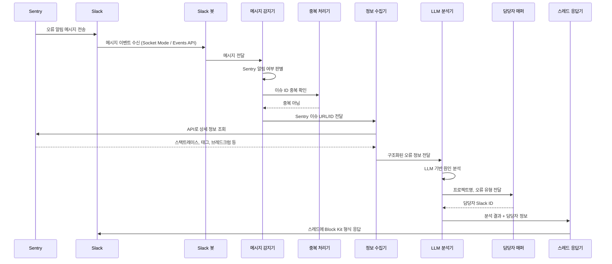
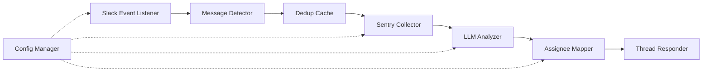

# 기술 설계 문서: Sentry-Slack 자동 분석 시스템

## 개요

Sentry에서 Slack으로 전달되는 오류 알림을 자동으로 감지하고, Sentry API를 통해 상세 정보를 수집한 뒤, LLM을 활용하여 원인 분석 및 해결 대안을 생성하여 Slack 스레드에 자동 응답하는 시스템이다.

### 핵심 흐름



### 기술 스택 결정

| 항목 | 선택 | 근거 |
|------|------|------|
| 런타임 | Node.js (TypeScript) | Slack Bolt SDK의 공식 지원, 비동기 I/O에 적합 |
| Slack 연동 | @slack/bolt | 공식 SDK, Socket Mode 지원, 이벤트 핸들링 내장 |
| Sentry API | REST API (axios) | 공식 REST API, 별도 SDK 불필요 |
| LLM | OpenAI API (openai SDK) | 구조화된 프롬프트 기반 분석에 적합 |
| 설정 관리 | YAML (yaml 패키지) + 환경 변수 | 가독성, 핫 리로드 용이 |
| 캐시 | 인메모리 Map + TTL | 단일 인스턴스 운영 기준, 외부 의존성 최소화 |
| 테스트 | Vitest + fast-check | 빠른 실행, PBT 지원 |

## 아키텍처

시스템은 파이프라인 패턴으로 구성된다. 각 단계는 독립적인 모듈로 분리되어 테스트와 교체가 용이하다.



### 모듈 구조

```
src/
├── index.ts                 # 앱 진입점, Bolt 앱 초기화
├── config/
│   └── configManager.ts     # 설정 파일 로드 및 핫 리로드
├── detector/
│   └── messageDetector.ts   # Sentry 알림 판별 로직
├── dedup/
│   └── dedupCache.ts        # 중복 이슈 필터링 (TTL 캐시)
├── collector/
│   └── sentryCollector.ts   # Sentry API 호출 및 정보 구조화
├── analyzer/
│   └── llmAnalyzer.ts       # LLM 프롬프트 구성 및 분석 실행
├── mapper/
│   └── assigneeMapper.ts    # 담당자 매핑 조회
├── responder/
│   └── threadResponder.ts   # Slack Block Kit 응답 생성 및 전송
└── types/
    └── index.ts             # 공유 타입 정의
```

## 컴포넌트 및 인터페이스

### 1. MessageDetector

Slack 메시지가 Sentry 알림인지 판별하고, 이슈 정보를 추출한다.

```typescript
interface DetectionResult {
  isSentryAlert: boolean;
  issueId: string | null;
  issueUrl: string | null;
  threadTs: string;
  channelId: string;
}

interface MessageDetector {
  detect(message: SlackMessage): DetectionResult;
}
```

판별 기준:
- 메시지 발신자가 Sentry 봇 사용자 ID와 일치
- 메시지 본문에 Sentry 이슈 URL 패턴 포함 (`https://<org>.sentry.io/issues/<id>`)

### 2. DedupCache

TTL 기반 인메모리 캐시로 중복 이슈 처리를 방지한다.

```typescript
interface DedupCache {
  has(issueId: string): boolean;
  add(issueId: string): void;
  clear(): void;
}
```

- TTL은 설정 파일에서 관리 (기본값: 30분)
- `Map<string, number>` 기반, 주기적 만료 항목 정리

### 3. SentryCollector

Sentry API를 호출하여 오류 상세 정보를 수집하고 구조화한다.

```typescript
interface SentryErrorDetail {
  issueId: string;
  title: string;
  errorMessage: string;
  stacktrace: string;
  projectName: string;
  level: string;
  environment: string;
  tags: Record<string, string>;
  breadcrumbs: Breadcrumb[];
  issueUrl: string;
}

interface SentryCollector {
  collect(issueId: string): Promise<SentryErrorDetail>;
}
```

- Sentry API 엔드포인트: `GET /api/0/issues/{issue_id}/events/latest/`
- 실패 시 `null` 반환, 호출자가 fallback 처리

### 4. LLMAnalyzer

수집된 오류 정보를 LLM에 전달하여 분석 결과를 생성한다.

```typescript
interface AnalysisResult {
  summary: string;           // 오류 요약
  rootCause: string;         // 추정 원인
  impactScope: string;       // 영향 범위
  relatedCode: string;       // 관련 코드 영역 추정
  possibleScenarios: string; // 발생 가능 시나리오
  solutions: string[];       // 해결 대안 (최소 1개)
  immediateActions: string[];// 즉시 대응 조치
}

interface LLMAnalyzer {
  analyze(errorDetail: SentryErrorDetail): Promise<AnalysisResult>;
}
```

- 타임아웃: 30초
- 실패 시 기본 응답(오류 정보 요약만 포함) 생성

### 5. AssigneeMapper

프로젝트명과 오류 유형을 기반으로 담당자를 조회한다.

```typescript
interface AssigneeMapping {
  projectName: string;
  errorType?: string;        // 선택적, 특정 오류 유형 매핑
  slackUserId: string;
}

interface AssigneeMapper {
  findAssignee(projectName: string, errorType: string): string; // Slack user ID
}
```

- 매핑 우선순위: 프로젝트+오류유형 > 프로젝트 > 기본 담당자
- 설정 파일에서 매핑 정보 로드

### 6. ThreadResponder

분석 결과를 Slack Block Kit 형식으로 변환하여 스레드에 게시한다.

```typescript
interface ThreadResponse {
  channelId: string;
  threadTs: string;
  blocks: SlackBlock[];
}

interface ThreadResponder {
  buildResponse(analysis: AnalysisResult, assigneeId: string, issueUrl: string): ThreadResponse;
  send(response: ThreadResponse): Promise<void>;
}
```

- 재시도: 최대 3회, 지수 백오프
- 3회 실패 시 관리자 알림 전송

### 7. ConfigManager

YAML 설정 파일을 로드하고 핫 리로드를 지원한다.

```typescript
interface AppConfig {
  slack: {
    botToken: string;        // 환경 변수에서 로드
    appToken: string;        // 환경 변수에서 로드
    channelIds: string[];
    sentryBotUserId: string;
  };
  sentry: {
    apiToken: string;        // 환경 변수에서 로드
    baseUrl: string;
  };
  llm: {
    apiKey: string;          // 환경 변수에서 로드
    model: string;
    timeoutMs: number;
  };
  dedup: {
    ttlMinutes: number;
  };
  assignees: AssigneeMapping[];
  defaultAssignee: string;
  adminSlackUserId: string;
}

interface ConfigManager {
  load(): AppConfig;
  watch(): void;             // 파일 변경 감시
  onReload(callback: (config: AppConfig) => void): void;
}
```

- 민감 정보(토큰, API 키)는 환경 변수에서 로드
- 비민감 설정은 YAML 파일에서 관리
- `fs.watch`로 파일 변경 감지, 콜백으로 리로드 알림

## 데이터 모델

### 설정 파일 (config.yaml)

```yaml
slack:
  channelIds:
    - "C01XXXXXXXX"
  sentryBotUserId: "U02XXXXXXXX"

sentry:
  baseUrl: "https://sentry.io"

llm:
  model: "gpt-4o"
  timeoutMs: 30000

dedup:
  ttlMinutes: 30

assignees:
  - projectName: "backend-api"
    slackUserId: "U03XXXXXXXX"
  - projectName: "backend-api"
    errorType: "DatabaseError"
    slackUserId: "U04XXXXXXXX"
  - projectName: "frontend-web"
    slackUserId: "U05XXXXXXXX"

defaultAssignee: "U06XXXXXXXX"
adminSlackUserId: "U07XXXXXXXX"
```

### Slack 메시지 이벤트 (수신)

```typescript
interface SlackMessage {
  type: string;
  user: string;              // 발신자 ID
  text: string;              // 메시지 본문
  ts: string;                // 메시지 타임스탬프
  channel: string;           // 채널 ID
  bot_id?: string;           // 봇 메시지인 경우
  attachments?: SlackAttachment[];
}
```

### Sentry API 응답 (주요 필드)

```typescript
interface SentryEventResponse {
  eventID: string;
  title: string;
  message: string;
  platform: string;
  entries: SentryEntry[];    // 스택트레이스, 브레드크럼 등
  tags: Array<{ key: string; value: string }>;
  context: Record<string, any>;
  projectID: string;
}
```

### 중복 캐시 엔트리

```typescript
// Map<issueId, expiresAt>
type DedupStore = Map<string, number>;
```

## 정확성 속성 (Correctness Properties)

*속성(property)이란 시스템의 모든 유효한 실행에서 참이어야 하는 특성 또는 동작이다. 속성은 사람이 읽을 수 있는 명세와 기계가 검증할 수 있는 정확성 보장 사이의 다리 역할을 한다.*

### Property 1: Sentry 알림 판별 정확성

*임의의* Slack 메시지에 대해, 해당 메시지의 발신자가 Sentry 봇 사용자 ID와 일치하거나 메시지 본문에 Sentry 이슈 URL 패턴이 포함된 경우에만 Sentry 알림으로 판별되어야 하며, 그 외의 메시지는 Sentry 알림이 아닌 것으로 판별되어야 한다.

**Validates: Requirements 1.1, 1.2, 1.3**

### Property 2: 감지 결과의 threadTs 보존

*임의의* Sentry 알림 메시지에 대해, detect 함수의 결과에 포함된 threadTs는 원본 메시지의 ts 값과 정확히 일치해야 한다.

**Validates: Requirements 1.4**

### Property 3: Sentry 이슈 ID 추출 정확성

*임의의* Sentry 이슈 URL을 포함한 메시지에 대해, 추출된 이슈 ID는 원본 URL에 포함된 이슈 ID와 정확히 일치해야 한다.

**Validates: Requirements 2.1**

### Property 4: Sentry API 응답 구조화

*임의의* 유효한 Sentry API 응답에 대해, 구조화 변환 결과는 SentryErrorDetail의 모든 필수 필드(issueId, title, errorMessage, stacktrace, projectName, level, environment, tags, breadcrumbs, issueUrl)를 포함해야 한다.

**Validates: Requirements 2.2, 2.4**

### Property 5: LLM 프롬프트 필수 정보 포함

*임의의* SentryErrorDetail에 대해, LLM에 전달되는 프롬프트 문자열은 오류 메시지, 스택트레이스, 브레드크럼 정보를 모두 포함해야 한다.

**Validates: Requirements 3.1**

### Property 6: 분석 결과 완전성

*임의의* 유효한 AnalysisResult에 대해, summary, rootCause, impactScope, relatedCode, possibleScenarios 필드가 비어있지 않아야 하며, solutions 배열은 최소 1개 이상의 항목을 포함해야 한다.

**Validates: Requirements 3.2, 3.3**

### Property 7: 담당자 매핑 완전성

*임의의* 프로젝트명과 오류 유형 조합에 대해, findAssignee 함수는 항상 유효한 Slack 사용자 ID를 반환해야 한다. 매핑에 일치하는 항목이 있으면 해당 담당자를, 없으면 기본 담당자를 반환한다.

**Validates: Requirements 4.1, 4.2**

### Property 8: 스레드 응답 필수 정보 포함

*임의의* AnalysisResult, 담당자 Slack ID, Sentry 이슈 URL에 대해, buildResponse 함수가 생성한 Block Kit 블록은 오류 요약, 추정 원인, 영향 범위, 해결 대안, 즉시 대응 조치, 담당자 멘션(`<@사용자ID>`), Sentry 이벤트 링크를 모두 포함해야 하며, 유효한 Slack Block Kit 구조여야 한다.

**Validates: Requirements 5.1, 5.2, 5.3**

### Property 9: 중복 이슈 무시

*임의의* 이슈 ID에 대해, 캐시에 추가한 직후 동일한 이슈 ID로 has()를 호출하면 true를 반환해야 하며, 이를 통해 중복 처리가 방지되어야 한다.

**Validates: Requirements 6.1, 6.2**

### Property 10: TTL 만료 후 재처리 허용

*임의의* 이슈 ID와 TTL 값에 대해, 캐시에 추가된 항목은 TTL 경과 후 has()가 false를 반환하여 재처리가 가능해야 한다.

**Validates: Requirements 6.3**

### Property 11: 설정 파일 파싱 라운드트립

*임의의* 유효한 AppConfig 객체에 대해, YAML로 직렬화한 후 다시 파싱하면 원본과 동등한 설정 객체가 복원되어야 한다.

**Validates: Requirements 7.1**

### Property 12: 필수 설정 누락 시 오류 발생

*임의의* 필수 설정 필드 중 하나 이상이 누락된 설정 객체에 대해, 설정 로드 시 누락된 필드를 명시하는 오류가 발생해야 한다.

**Validates: Requirements 7.3**

## 오류 처리

### 외부 API 실패

| 실패 지점 | 처리 방식 | 근거 |
|-----------|----------|------|
| Sentry API 호출 실패 | Slack 메시지 본문에서 추출 가능한 정보만으로 분석 진행 | 요구사항 2.3 |
| LLM API 호출 실패 | 오류 정보 요약만 포함한 기본 응답 생성 | 요구사항 3.4 |
| Slack API 호출 실패 | 최대 3회 재시도 (지수 백오프), 3회 실패 시 관리자 알림 | 요구사항 5.4, 5.5 |

### 설정 오류

- 필수 설정 누락 시: 시작 시 명확한 오류 메시지와 함께 프로세스 종료
- 환경 변수 미설정 시: 시작 시 누락된 변수명을 포함한 오류 메시지 출력

### 재시도 전략

```typescript
// Slack API 재시도 - 지수 백오프
const RETRY_DELAYS = [1000, 2000, 4000]; // ms

async function withRetry<T>(
  fn: () => Promise<T>,
  maxRetries: number = 3
): Promise<T> {
  for (let attempt = 0; attempt < maxRetries; attempt++) {
    try {
      return await fn();
    } catch (error) {
      if (attempt === maxRetries - 1) throw error;
      await sleep(RETRY_DELAYS[attempt]);
    }
  }
  throw new Error('Unreachable');
}
```

### 로깅

- 모든 외부 API 호출의 성공/실패를 로깅
- 오류 발생 시 컨텍스트 정보(이슈 ID, 채널 ID 등) 포함
- 구조화된 로그 형식 (JSON) 사용

## 테스트 전략

### 테스트 프레임워크

- **단위 테스트 및 속성 기반 테스트**: Vitest + fast-check
- 속성 기반 테스트는 테스트당 최소 100회 반복 실행
- 각 속성 테스트는 설계 문서의 속성 번호를 주석으로 참조

### 단위 테스트

단위 테스트는 구체적인 예시, 에지 케이스, 오류 조건에 집중한다.

- **MessageDetector**: Sentry 봇 메시지, Sentry URL 포함 메시지, 일반 메시지 각각의 판별 결과
- **SentryCollector**: API 실패 시 fallback 동작 (요구사항 2.3)
- **LLMAnalyzer**: LLM API 실패 시 기본 응답 생성 (요구사항 3.4)
- **ThreadResponder**: Slack API 재시도 로직 (3회 재시도 후 관리자 알림, 요구사항 5.4, 5.5)
- **ConfigManager**: 필수 설정 누락 시 오류 메시지 검증

### 속성 기반 테스트

각 속성 테스트는 하나의 정확성 속성을 검증하며, 다음 태그 형식을 사용한다:

```
// Feature: sentry-slack-auto-analysis, Property 1: Sentry 알림 판별 정확성
```

| 속성 | 테스트 대상 모듈 | 생성기 |
|------|----------------|--------|
| Property 1 | MessageDetector | 임의의 SlackMessage (Sentry 봇 ID / Sentry URL / 일반 메시지) |
| Property 2 | MessageDetector | 임의의 Sentry 알림 메시지 + ts 값 |
| Property 3 | MessageDetector | 임의의 Sentry 이슈 URL 문자열 |
| Property 4 | SentryCollector | 임의의 SentryEventResponse 객체 |
| Property 5 | LLMAnalyzer | 임의의 SentryErrorDetail 객체 |
| Property 6 | LLMAnalyzer | 임의의 AnalysisResult 객체 |
| Property 7 | AssigneeMapper | 임의의 프로젝트명 + 오류 유형 + 매핑 설정 |
| Property 8 | ThreadResponder | 임의의 AnalysisResult + 담당자 ID + 이슈 URL |
| Property 9 | DedupCache | 임의의 이슈 ID 문자열 |
| Property 10 | DedupCache | 임의의 이슈 ID + TTL 값 |
| Property 11 | ConfigManager | 임의의 유효한 AppConfig 객체 |
| Property 12 | ConfigManager | 임의의 필수 필드 누락 설정 |

### 통합 테스트

- 전체 파이프라인 흐름 (메시지 감지 → 정보 수집 → 분석 → 응답)을 모킹된 외부 API로 검증
- Slack Socket Mode 연결 및 이벤트 수신 검증
- 설정 파일 핫 리로드 동작 검증
