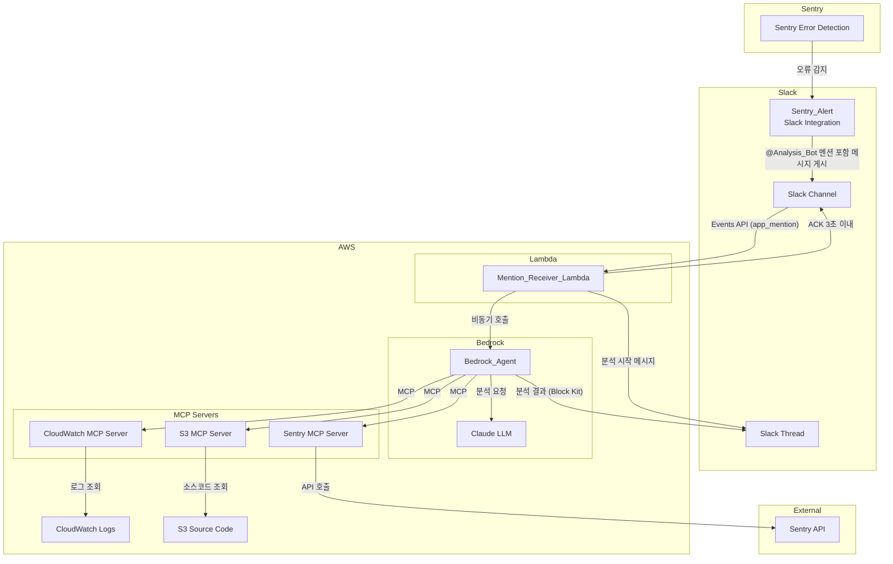
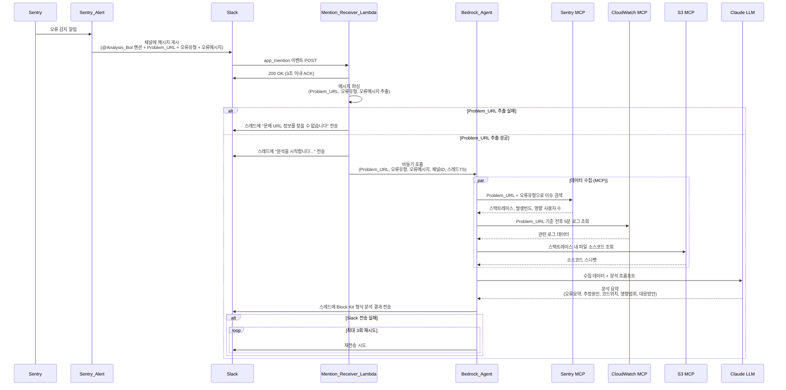
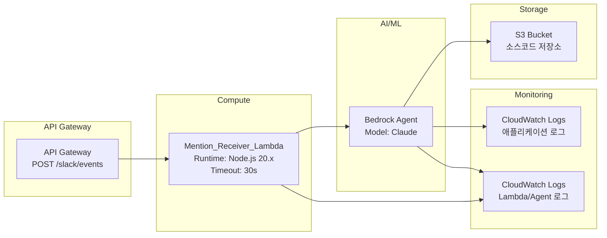

# 설계 문서: Sentry-Slack 자동 분석 봇

## 개요

Sentry에서 오류 알림이 발생하면 Sentry_Alert가 Slack 채널에 메시지를 게시하면서 @Analysis_Bot을 자동 멘션한다. Analysis_Bot은 Slack Events API를 통해 멘션 이벤트를 감지하고, Mention_Receiver_Lambda를 트리거한다. Lambda는 메시지에서 문제 URL, 오류 유형, 오류 메시지를 파싱한 뒤 Bedrock Agent를 비동기 호출한다. Bedrock Agent는 MCP를 통해 Sentry API, CloudWatch Logs, S3 소스코드를 수집하고 LLM으로 장애 원인 분석 요약을 생성한다. 최종 결과는 Block Kit 형식으로 원래 Slack 스레드에 전송된다.

핵심 설계 원칙:
- 부분 실패 허용(Partial Failure Tolerance): 데이터 소스 중 일부가 실패해도 나머지로 분석 진행
- 비동기 처리: Slack 3초 ACK 제약을 충족하기 위해 Bedrock Agent 호출은 비동기

## 아키텍처

### 시스템 아키텍처 다이어그램



### 시퀀스 다이어그램 (메인 플로우)



## 컴포넌트 및 인터페이스

### 1. Mention_Receiver_Lambda

Slack Events API의 `app_mention` 이벤트를 수신하는 AWS Lambda 함수.

**책임:**
- 3초 이내 ACK 응답
- 멘션 메시지에서 채널 ID, 스레드 TS, 메시지 텍스트 추출
- 메시지 본문에서 Problem_URL, 오류 유형, 오류 메시지 파싱
- Bedrock Agent 비동기 호출

**인터페이스:**

```typescript
// Slack Events API → Lambda 입력
interface SlackEventPayload {
  token: string;
  type: "event_callback" | "url_verification";
  event: {
    type: "app_mention";
    channel: string;        // Slack 채널 ID
    ts: string;             // 이벤트 타임스탬프
    thread_ts?: string;     // 스레드 타임스탬프 (멘션이 스레드 내인 경우)
    text: string;           // 멘션 메시지 전체 텍스트
    user: string;           // 멘션을 보낸 사용자/봇 ID
  };
}

// Lambda → Bedrock Agent 호출 파라미터
interface BedrockAgentInput {
  problemUrl: string;       // 오류 발생 서비스 URL
  errorType: string;        // 오류 유형 (e.g., "TypeError", "500 Internal Server Error")
  errorMessage: string;     // 오류 메시지 상세
  slackChannelId: string;   // 응답할 Slack 채널 ID
  slackThreadTs: string;    // 응답할 스레드 타임스탬프
}
```

**메시지 파싱 로직:**

Sentry_Alert가 게시하는 메시지는 구조화된 형식을 따른다. Lambda는 메시지 텍스트에서 다음을 추출한다:
- Problem_URL: Sentry 이슈 URL(`*.sentry.io*` 패턴)을 제외한 HTTP/HTTPS URL
- 오류 유형: 메시지 내 오류 분류 텍스트 (예: `TypeError`, `500 Internal Server Error`)
- 오류 메시지: 오류 상세 설명 텍스트

```typescript
// URL 파싱 로직 (의사코드)
function extractProblemUrl(messageText: string): string | null {
  const urls = extractAllUrls(messageText);
  // Sentry 도메인 URL 제외 (이슈 URL, 대시보드 URL 등)
  const nonSentryUrls = urls.filter(url => !isSentryUrl(url));
  return nonSentryUrls.length > 0 ? nonSentryUrls[0] : null;
}

function isSentryUrl(url: string): boolean {
  const sentryPatterns = [
    /sentry\.io/i,
    /\.sentry\.io/i,
  ];
  return sentryPatterns.some(pattern => pattern.test(url));
}
```

### 2. Bedrock_Agent

AWS Bedrock Agent로, MCP 서버를 통해 외부 데이터를 수집하고 LLM으로 분석 요약을 생성한다.

**책임:**
- MCP를 통한 3개 데이터 소스 접근 (Sentry API, CloudWatch Logs, S3)
- 부분 실패 시 수집 가능한 데이터로 분석 계속 진행
- LLM에 수집 데이터 전달 및 분석 요약 생성
- Slack 스레드에 분석 결과 전송 (Block Kit 형식)

**MCP 서버 구성:**

```yaml
# Bedrock Agent MCP 서버 설정
mcpServers:
  sentry:
    description: "Sentry API를 통한 오류 상세 정보 수집"
    tools:
      - searchIssuesByUrl:
          description: "Problem URL과 오류 유형으로 Sentry 이슈 검색"
          parameters:
            problemUrl: string
            errorType: string
          returns: "스택트레이스, 오류 메시지, 발생 빈도, 영향 사용자 수"
      - getIssueDetails:
          description: "특정 Sentry 이슈의 상세 정보 조회"
          parameters:
            issueId: string
          returns: "이벤트 목록, 태그, 환경 정보"

  cloudwatch:
    description: "CloudWatch Logs에서 관련 로그 수집"
    tools:
      - queryLogsByUrl:
          description: "Problem URL 기준 전후 5분 로그 조회"
          parameters:
            problemUrl: string
            timeRangeMinutes: number  # 기본값 5
          returns: "시간순 로그 엔트리 목록"

  s3SourceCode:
    description: "S3에 저장된 소스코드 조회"
    tools:
      - getSourceFile:
          description: "스택트레이스 파일 경로로 소스코드 조회"
          parameters:
            filePath: string
            lineRange:
              start: number
              end: number
          returns: "소스코드 스니펫"
```

### 3. Analysis_Bot (Slack Bot)

Slack 워크스페이스에 등록된 봇 애플리케이션.

**책임:**
- `app_mention` 이벤트 구독 (Events API)
- 상태 메시지 전송 ("분석을 시작합니다...")
- 분석 결과를 Block Kit 형식으로 스레드에 전송
- 전송 실패 시 최대 3회 재시도

**Slack Bot 권한 (OAuth Scopes):**
- `app_mentions:read` - 멘션 이벤트 수신
- `chat:write` - 메시지 전송
- `channels:history` - 채널 메시지 읽기 (스레드 컨텍스트)

**Block Kit 응답 구조:**

```json
{
  "channel": "<channel_id>",
  "thread_ts": "<thread_ts>",
  "blocks": [
    {
      "type": "header",
      "text": { "type": "plain_text", "text": "🔍 장애 분석 결과" }
    },
    {
      "type": "section",
      "text": { "type": "mrkdwn", "text": "*오류 요약*\n<오류 요약 내용>" }
    },
    {
      "type": "section",
      "text": { "type": "mrkdwn", "text": "*추정 원인*\n<추정 원인 내용>" }
    },
    {
      "type": "section",
      "text": { "type": "mrkdwn", "text": "*관련 코드 위치*\n<코드 위치 내용>" }
    },
    {
      "type": "section",
      "text": { "type": "mrkdwn", "text": "*영향 범위*\n<영향 범위 내용>" }
    },
    {
      "type": "section",
      "text": { "type": "mrkdwn", "text": "*권장 대응 방안*\n<대응 방안 내용>" }
    },
    {
      "type": "context",
      "elements": [
        { "type": "mrkdwn", "text": "⚠️ Sentry 데이터 수집 실패 - 부분 분석 결과입니다" }
      ]
    }
  ]
}
```

### 4. AWS 인프라 컴포넌트



**Lambda 환경 변수:**

| 환경 변수 | 설명 |
|-----------|------|
| `BEDROCK_AGENT_ID` | Bedrock Agent ID |
| `BEDROCK_AGENT_ALIAS_ID` | Bedrock Agent Alias ID |

## 데이터 모델

### Slack 이벤트 데이터

```typescript
// Slack url_verification 챌린지 (봇 등록 시)
interface SlackUrlVerification {
  type: "url_verification";
  token: string;
  challenge: string;
}

// Slack app_mention 이벤트
interface SlackAppMentionEvent {
  type: "event_callback";
  token: string;
  team_id: string;
  event: {
    type: "app_mention";
    channel: string;
    ts: string;
    thread_ts?: string;
    text: string;
    user: string;
  };
  event_id: string;
  event_time: number;
}
```

### 파싱된 Sentry 알림 데이터

```typescript
interface ParsedSentryAlert {
  problemUrl: string | null;    // 오류 발생 서비스 URL (Sentry URL 제외)
  errorType: string | null;     // 오류 유형
  errorMessage: string | null;  // 오류 메시지
  rawText: string;              // 원본 메시지 텍스트
}
```

### Bedrock Agent 입출력

```typescript
// Bedrock Agent 입력
interface AnalysisRequest {
  problemUrl: string;
  errorType: string;
  errorMessage: string;
  slackChannelId: string;
  slackThreadTs: string;
}

// MCP 데이터 수집 결과
interface CollectedData {
  sentry: {
    success: boolean;
    stackTrace?: string;
    errorDetails?: string;
    frequency?: number;
    affectedUsers?: number;
    failureReason?: string;
  };
  cloudwatch: {
    success: boolean;
    logs?: LogEntry[];
    failureReason?: string;
  };
  sourceCode: {
    success: boolean;
    snippets?: CodeSnippet[];
    failureReason?: string;
  };
}

interface LogEntry {
  timestamp: string;
  message: string;
  logGroup: string;
  logStream: string;
}

interface CodeSnippet {
  filePath: string;
  startLine: number;
  endLine: number;
  content: string;
}

// LLM 분석 결과
interface AnalysisResult {
  errorSummary: string;         // 오류 요약
  estimatedCause: string;       // 추정 원인
  relatedCodeLocation: string;  // 관련 코드 위치
  impactScope: string;          // 영향 범위
  recommendedActions: string;   // 권장 대응 방안
  dataCollectionNotes: string[];// 데이터 수집 실패 메모
  isPartialResult: boolean;     // 부분 결과 여부
}
```

### Slack 응답 데이터

```typescript
interface SlackThreadResponse {
  channel: string;
  thread_ts: string;
  blocks: SlackBlock[];
}

interface SlackRetryConfig {
  maxRetries: 3;
  retryDelayMs: 1000;  // 1초 간격, 지수 백오프 적용
  backoffMultiplier: 2;
}
```


## 정확성 속성 (Correctness Properties)

*속성(Property)이란 시스템의 모든 유효한 실행에서 참이어야 하는 특성 또는 동작이다. 속성은 사람이 읽을 수 있는 명세와 기계가 검증할 수 있는 정확성 보장 사이의 다리 역할을 한다.*

### Property 1: Slack 이벤트 페이로드 파싱

*For any* 유효한 Slack `app_mention` 이벤트 페이로드에 대해, 이벤트 추출 함수는 채널 ID, 스레드 타임스탬프, 멘션 메시지 텍스트를 정확하게 추출해야 하며, 추출된 값은 원본 페이로드의 해당 필드와 일치해야 한다.

**Validates: Requirements 1.3**

### Property 2: Sentry 알림 메시지 파싱 및 URL 필터링

*For any* Sentry 알림 메시지 텍스트에 대해, 파싱 함수가 추출한 문제 URL은 Sentry 도메인(`*.sentry.io`)에 해당하는 URL을 포함하지 않아야 하며, 메시지에 포함된 실제 서비스 URL만 반환해야 한다. 또한 오류 유형과 오류 메시지가 메시지 본문에서 올바르게 추출되어야 한다.

**Validates: Requirements 2.1, 2.2**

### Property 3: Bedrock Agent 호출 파라미터 완전성

*For any* 성공적으로 파싱된 Sentry 알림 데이터와 유효한 Slack 이벤트 컨텍스트에 대해, Bedrock Agent 호출 파라미터는 반드시 문제 URL, 오류 유형, 오류 메시지, Slack 채널 ID, 스레드 타임스탬프 5개 필드를 모두 포함해야 한다.

**Validates: Requirements 3.2**

### Property 4: 부분 실패 허용 (Partial Failure Tolerance)

*For any* 데이터 소스(Sentry API, CloudWatch Logs, S3) 실패 조합에 대해, 최소 하나의 데이터 소스가 성공하면 분석 결과가 생성되어야 하며, 실패한 데이터 소스는 분석 결과의 `dataCollectionNotes`에 명시되어야 한다.

**Validates: Requirements 4.4, 4.5, 4.6**

### Property 5: 분석 결과 필수 필드 포함

*For any* 생성된 분석 결과(AnalysisResult)에 대해, 오류 요약(`errorSummary`), 추정 원인(`estimatedCause`), 관련 코드 위치(`relatedCodeLocation`), 영향 범위(`impactScope`), 권장 대응 방안(`recommendedActions`) 5개 필드가 모두 비어있지 않은 값으로 포함되어야 한다.

**Validates: Requirements 5.2**

### Property 6: Block Kit 형식 변환

*For any* 유효한 AnalysisResult에 대해, Block Kit 변환 함수는 Slack Block Kit 스펙에 부합하는 구조를 반환해야 하며, 분석 결과의 5개 필수 항목(오류 요약, 추정 원인, 관련 코드 위치, 영향 범위, 권장 대응 방안)이 모두 블록에 포함되어야 한다.

**Validates: Requirements 6.2**

## 오류 처리 (Error Handling)

### 이벤트 수신 단계

| 오류 상황 | 처리 방식 |
|-----------|----------|
| 채널 ID 또는 스레드 TS 누락 | 요청 무시, CloudWatch에 오류 로그 기록 |
| Slack 이벤트 페이로드 파싱 실패 | 요청 무시, CloudWatch에 오류 로그 기록 |
| `url_verification` 요청 | `challenge` 값을 즉시 반환 (봇 등록 플로우) |

### 메시지 파싱 단계

| 오류 상황 | 처리 방식 |
|-----------|----------|
| 문제 URL 추출 실패 | Slack 스레드에 "Sentry 알림에서 문제 URL 정보를 찾을 수 없습니다" 안내 메시지 전송 |
| 오류 유형/메시지 추출 실패 | 추출 가능한 정보만으로 Bedrock Agent 호출 진행 (문제 URL은 필수) |

### Bedrock Agent 호출 단계

| 오류 상황 | 처리 방식 |
|-----------|----------|
| Bedrock Agent 호출 실패 | Slack 스레드에 "분석 에이전트 호출에 실패했습니다. 잠시 후 다시 시도해주세요." 오류 메시지 전송 |
| Bedrock Agent 호출 예외 | CloudWatch에 상세 오류 로그 기록 |

### 데이터 수집 단계 (부분 실패 허용)

| 오류 상황 | 처리 방식 |
|-----------|----------|
| Sentry API 접근 실패 | 나머지 소스로 계속 수집, 분석 결과에 "Sentry 데이터 수집 실패" 명시 |
| CloudWatch Logs 접근 실패 | 나머지 소스로 계속 수집, 분석 결과에 "CloudWatch 데이터 수집 실패" 명시 |
| S3 소스코드 접근 실패 | 나머지 소스로 계속 수집, 분석 결과에 "소스코드 수집 실패" 명시 |
| 모든 데이터 소스 실패 | 수집 가능한 범위 내에서 요약 생성, 추가 조사 필요 영역 명시 |

### Slack 응답 전송 단계

| 오류 상황 | 처리 방식 |
|-----------|----------|
| Slack 메시지 전송 실패 | 지수 백오프(1초, 2초, 4초)로 최대 3회 재시도 |
| 3회 재시도 후에도 실패 | CloudWatch Logs에 전송 실패 기록 |

## 테스트 전략 (Testing Strategy)

### 테스트 접근 방식

단위 테스트와 속성 기반 테스트(Property-Based Testing)를 병행하여 포괄적인 검증을 수행한다.

- **단위 테스트**: 특정 예제, 에지 케이스, 오류 조건 검증
- **속성 기반 테스트**: 모든 입력에 대해 보편적으로 성립해야 하는 속성 검증

두 방식은 상호 보완적이며, 단위 테스트는 구체적인 버그를 잡고, 속성 테스트는 일반적인 정확성을 보장한다.

### 속성 기반 테스트 (Property-Based Testing)

**라이브러리**: `fast-check` (TypeScript/Node.js 환경)

**설정**:
- 각 속성 테스트는 최소 100회 반복 실행
- 각 테스트에 설계 문서의 속성 번호를 태그로 참조
- 태그 형식: `Feature: sentry-slack-auto-analysis, Property {number}: {property_text}`
- 각 정확성 속성은 하나의 속성 기반 테스트로 구현

**속성 테스트 목록**:

| 속성 | 테스트 설명 | 생성기 |
|------|-----------|--------|
| Property 1 | Slack 이벤트 페이로드에서 채널 ID, 스레드 TS, 텍스트 추출 검증 | 랜덤 채널 ID, 타임스탬프, 텍스트를 가진 Slack 이벤트 페이로드 생성 |
| Property 2 | Sentry 알림 메시지 파싱 시 Sentry URL 제외 및 서비스 URL 추출 검증 | Sentry URL과 서비스 URL이 혼합된 랜덤 메시지 텍스트 생성 |
| Property 3 | Bedrock Agent 호출 파라미터 5개 필드 완전성 검증 | 랜덤 ParsedSentryAlert + Slack 이벤트 컨텍스트 생성 |
| Property 4 | 데이터 소스 실패 조합에 대한 부분 실패 허용 검증 | 3개 데이터 소스의 성공/실패 조합(2^3 = 8가지) 랜덤 생성 |
| Property 5 | 분석 결과 필수 5개 필드 비어있지 않음 검증 | 랜덤 CollectedData로부터 AnalysisResult 생성 |
| Property 6 | Block Kit 변환 결과에 필수 5개 항목 포함 검증 | 랜덤 AnalysisResult 생성 후 Block Kit 변환 |

### 단위 테스트

**이벤트 수신 (요구사항 1)**:
- `url_verification` 챌린지 응답 테스트
- 유효한 `app_mention` 이벤트 처리 테스트
- 채널 ID 누락 시 요청 무시 테스트
- 스레드 TS 누락 시 요청 무시 테스트

**메시지 파싱 (요구사항 2)**:
- Sentry URL과 서비스 URL이 혼합된 메시지에서 서비스 URL만 추출하는 테스트
- 문제 URL이 없는 메시지에서 null 반환 테스트
- 오류 유형/메시지 추출 테스트

**Bedrock Agent 호출 (요구사항 3)**:
- 성공적 파싱 후 비동기 호출 트리거 테스트
- 호출 실패 시 오류 메시지 전송 테스트
- "분석을 시작합니다..." 상태 메시지 전송 테스트

**데이터 수집 (요구사항 4)**:
- 개별 데이터 소스 실패 시 나머지 계속 수집 테스트
- 실패 소스가 결과에 명시되는지 테스트

**분석 요약 (요구사항 5)**:
- 분석 결과 필수 필드 포함 테스트
- 부분 데이터로 분석 시 추가 조사 영역 명시 테스트

**Slack 응답 (요구사항 6)**:
- Block Kit 형식 변환 테스트
- 전송 실패 시 최대 3회 재시도 테스트
- 3회 실패 후 CloudWatch 로깅 테스트
